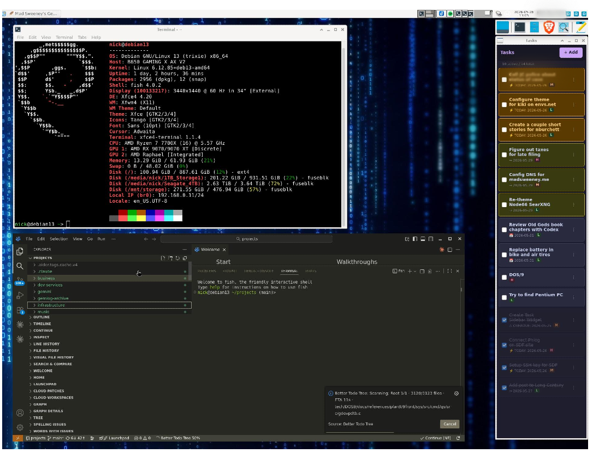

# task-widget

A lightweight GTK4 task sidebar for Linux. Keeps a sorted task list in a narrow window you dock to the side of your screen. Tasks due today or overdue are highlighted so you can't miss them.



  

## Features

- Tasks sorted by due date, then priority
- Colour-coded urgency: overdue (red), due today (amber), due soon (yellow)
- Priority levels: High / Medium / Low
- Optional notes per task
- Mark done → strikethrough; auto-archived 14 days after completion
- Persistent SQLite storage at `~/.local/share/task_sidebar/tasks.db`
- Hourly highlight refresh (no restart needed when the date rolls over)

## Requirements

System packages only — no pip dependencies:

```bash
sudo apt install python3-gi gir1.2-gtk-4.0
```

## Installation

**1. Clone the repo:**

```bash
git clone https://github.com/njb1966/task-widget.git
cd task-widget
```

**2. Install the launcher script:**

```bash
sudo install -m 755 task-sidebar /usr/local/bin/task-sidebar
```

**3. Install the desktop entry and icon:**

```bash
mkdir -p ~/.local/share/applications ~/.local/share/icons/hicolor/scalable/apps

# If you have librsvg2-bin installed, generate a PNG for better compatibility:
sudo apt install -y librsvg2-bin
mkdir -p ~/.local/share/icons/hicolor/48x48/apps
rsvg-convert -w 48 -h 48 icon.svg -o ~/.local/share/icons/hicolor/48x48/apps/task-sidebar.png

update-desktop-database ~/.local/share/applications/
```

> The `.desktop` file uses an absolute path for the icon, so no icon theme cache setup is needed.

**4. Run:**

```bash
task-sidebar
# or search "Tasks" in your app launcher
```

## Usage

| Action | How |
|---|---|
| Add task | Click **+ Add** in the toolbar |
| Edit task | Click **⋮** → Edit on any row |
| Delete task | Click **⋮** → Delete on any row |
| Mark done | Tick the checkbox — task moves to bottom with strikethrough |
| Archive | Happens automatically 14 days after a task is marked done |

## Highlight colours

| State | Colour |
|---|---|
| Overdue | Red border + `⚠ OVERDUE:` prefix |
| Due today | Amber + `⚡ TODAY:` prefix |
| Due within 3 days | Muted yellow + `→` prefix |
| Future / no date | Default (dark) |
| Done | Dimmed with strikethrough |

## File layout

```
main.py          # Application window and entry point
store.py         # SQLite layer
task_row.py      # Per-task ListBoxRow widget
add_dialog.py    # Add / Edit dialog
style.css        # GTK4 CSS theme (dark, Catppuccin-inspired)
task-sidebar     # Shell launcher script
```

## License

MIT
